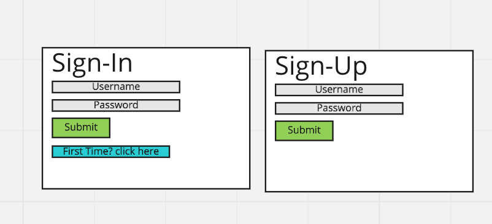
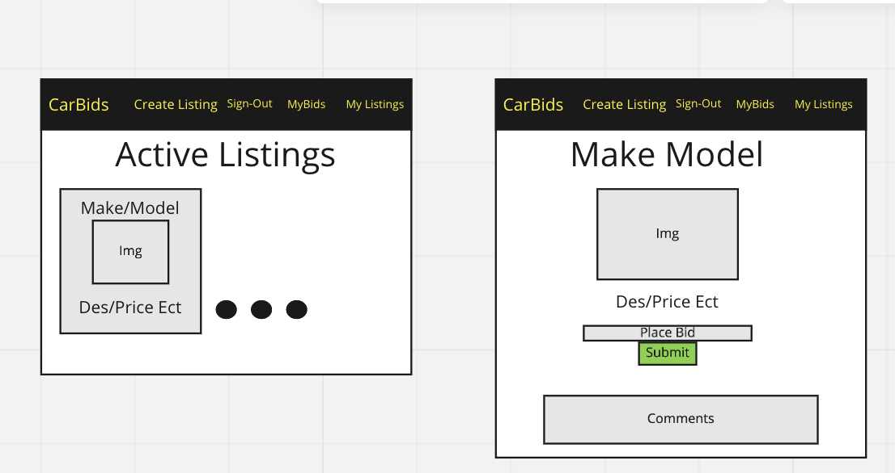
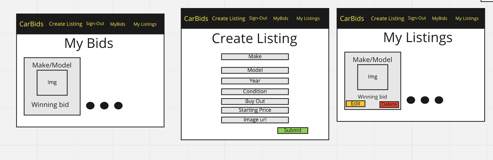
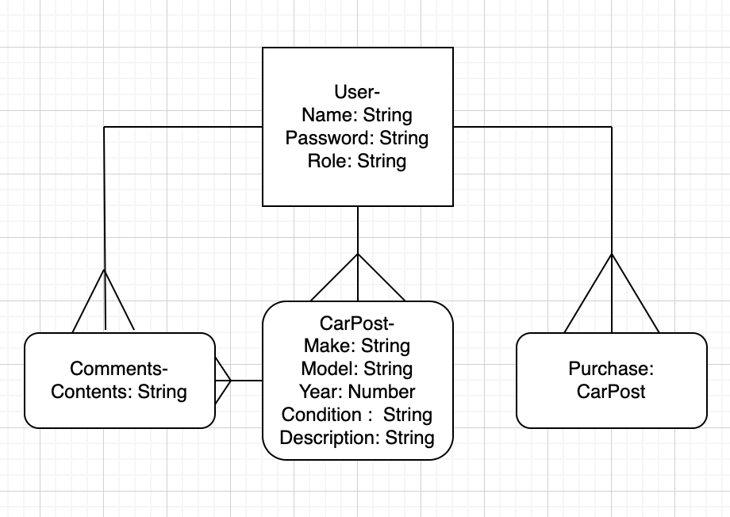

# CarBid Client

A front end client app for buying cars via bidding or outright purchase

## Installation

## About

The client is where the user interacts with the store. Here is where a user can bid battle other for a specific vehicle with live updates

## Wireframes

## ERD

## API

https://github.com/jadenRuplal/project-4-carbid-api

## User Stories

    -As a registered user, I would like to sign in with email and password.
    -As a signed in user, I would like to change password.
    -As a signed in user, I would like to sign out.
    -As an admin, I would like to:
        -Delete messages that people are unacceptable
    -As a signed in user, I would like to purchase products outright using Stripe with react https://github.com/azmenak/react-stripe-checkout
    -As a signed in user, I would like to see my listings that I have posted

    ### Stretch
        -Have a filter
        -potentially to way interaction live
